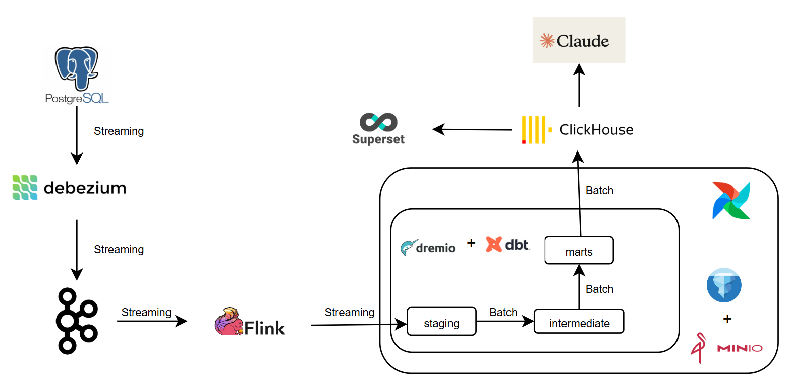
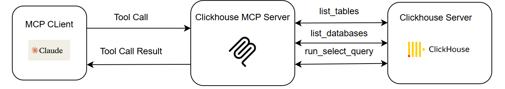

# VTHMoney Lakehouse System

This project builds a complete data lakehouse system using Docker Compose to manage various services. The system includes components for collecting, processing, storing, and visualizing data.

## Architecture

### Data Pipeline



### MCP Server



## Services

Below is a list of services defined in `docker-compose.yml`:

| Service            | Description                                                                                                          |
| :----------------- | :------------------------------------------------------------------------------------------------------------------- |
| **PostgreSQL**     | The main application database, where initial transaction data is stored.                                             |
| **Zookeeper**      | A centralized service for maintaining configuration information and providing distributed synchronization for Kafka. |
| **Kafka**          | A distributed streaming platform used to receive CDC data from Debezium.                                             |
| **Debezium**       | A Change Data Capture (CDC) service that monitors and records changes from PostgreSQL into Kafka.                    |
| **Kafka UI**       | A web interface for managing and monitoring topics in Kafka.                                                         |
| **Data Generator** | A service that automatically generates initial data into PostgreSQL.                                                 |
| **MinIO**          | An S3-compatible object storage system that serves as the data lake.                                                 |
| **Hive Metastore** | A service that stores metadata for tables in the data lake (used by Flink and Dremio).                               |
| **Flink**          | A stream processing framework that processes data from Kafka and stores it in MinIO in Iceberg format.               |
| **Dremio**         | A high-speed data query engine that allows querying data directly on the data lake.                                  |
| **Airflow**        | A workflow orchestration platform used to run dbt jobs and import data into ClickHouse.                              |
| **dbt**            | A data transformation tool that executes data transformation models in the data warehouse/lakehouse.                 |
| **ClickHouse**     | A column-oriented analytical database used for reports and dashboards.                                               |
| **Superset**       | A data visualization tool that connects to ClickHouse to build dashboards.                                           |
| **Chatbot UI**     | A chatbot interface for interacting with and querying data from ClickHouse.                                          |

## Requirements

- [Docker](https://docs.docker.com/get-docker/)
- [Docker Compose](https://docs.docker.com/compose/install/)

## Setup and Launch Instructions

### 1. Clone the Repository

```bash
git clone https://github.com/thaihung110/VTHMoney-LakehouseSystem.git
cd VTHMoney-LakehouseSystem
```

### 2. Build and Start the Services

Use the following command to build and start all services:

```bash
docker-compose up -d
```

This command will download the necessary images and start the containers in detached mode. The initialization process may take a few minutes.

### 3. Initialize Flink Job for Real-time Ingestion

To start ingesting data from Kafka into the MinIO data lake (in Iceberg format), you need to submit a job to the Flink cluster.

1.  Access the Flink SQL client:

    ```bash
    docker exec -it flink ./bin/sql-client.sh
    ```

2.  Inside the SQL client, copy and paste the entire content of the `flink/sql_cmd.sql` file. This will create the necessary tables and start the ingestion job.

### 4. Create Mart Tables in ClickHouse

Before Airflow can load data into ClickHouse, you need to create the target tables.

1.  Access the ClickHouse client:

    ```bash
    docker exec -it clickhouse clickhouse-client --user=admin --password=password
    ```

2.  Inside the client, execute the `CREATE TABLE` statements found in the `clickhouse/create_clickhouse_table.sql` file to create the necessary tables in the `marts` database.

### 5. Trigger Airflow DAGs

The final steps of the pipeline are orchestrated by Airflow.

1.  Open the Airflow UI in your browser: [http://localhost:8082](http://localhost:8082)
2.  Log in with username `admin` and password `admin`.
3.  On the DAGs page, enable and run the following DAGs in order:
    1.  `dbt_dremio_dag`: Transforms raw data in the data lake into data marts.
    2.  `import_marts_to_clickhouse`: Loads the data marts into ClickHouse.

## Data Pipeline

1.  **Data Generation**: The `datagen` service automatically inserts sample data into the `PostgreSQL` database.
2.  **Change Data Capture (CDC)**: `Debezium` monitors changes in the PostgreSQL tables and pushes change events (insert, update, delete) to the corresponding topics in `Kafka`.
3.  **Stream Processing**: `Flink` reads the streaming data from Kafka, processes it, and writes it to the `MinIO` data lake in Apache Iceberg table format.
4.  **Data Transformation**: `Airflow` orchestrates `dbt` to execute data transformation models. `dbt` connects to `Dremio` to query and transform data in MinIO, creating cleaned and aggregated mart tables.
5.  **Load to Analytics DB**: Another DAG in `Airflow` reads data from the mart tables and loads it into `ClickHouse` for fast querying and analysis.
6.  **Data Visualization**: `Superset` connects to `ClickHouse` to create reports and interactive dashboards.

## Accessing Services

You can access the user interfaces of the services at the following ports:

| Service               | URL                                            | Username | Password        |
| :-------------------- | :--------------------------------------------- | :------- | :-------------- |
| **Kafka UI**          | [http://localhost:8080](http://localhost:8080) | -        | -               |
| **Flink UI**          | [http://localhost:8081](http://localhost:8081) | -        | -               |
| **Airflow UI**        | [http://localhost:8082](http://localhost:8082) | `admin`  | `admin`         |
| **MinIO Console**     | [http://localhost:9001](http://localhost:9001) | `admin`  | `password`      |
| **Dremio UI**         | [http://localhost:9047](http://localhost:9047) | `hungvt` | `thaihunghp123` |
| **Superset UI**       | [http://localhost:8088](http://localhost:8088) | `admin`  | `admin`         |
| **ClickHouse (HTTP)** | [http://localhost:8123](http://localhost:8123) | `admin`  | `password`      |
| **Chatbot UI**        | [http://localhost:8501](http://localhost:8501) | -        | -               |

## Stopping the System

To stop all services, use the command:

```bash
docker-compose down
```

To stop all services and remove all volumes (data), use the command:

```bash
docker-compose down -v
```
