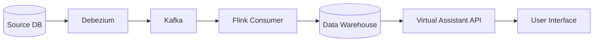

# System Patterns

## Architecture Overview

### Data Flow Architecture

## Key Components

### 1. Data Capture Layer

- Debezium monitors source database changes
- CDC events are captured and streamed to Kafka
- Ensures real-time data synchronization

### 2. Stream Processing Layer

- Flink consumes CDC events from Kafka
- Transforms data according to warehouse schema
- Handles data validation and enrichment

### 3. Storage Layer

- Data warehouse optimized for analytics
- Structured for efficient querying
- Supports both real-time and historical data

### 4. API Layer

- RESTful endpoints for data access
- Virtual assistant integration
- Query processing and optimization

## Design Patterns

### 1. Event-Driven Architecture

- Change events trigger data synchronization
- Loose coupling between components
- Scalable message processing

### 2. Stream Processing

- Continuous data processing
- Stateful operations when needed
- Error handling and recovery

### 3. Data Warehouse Design

- Dimensional modeling
- Fact and dimension tables
- Optimized for analytical queries

## System Interactions

1. Source changes trigger Debezium events
2. Events are queued in Kafka topics
3. Flink processes and transforms data
4. Data is loaded into warehouse
5. API provides access to processed data
